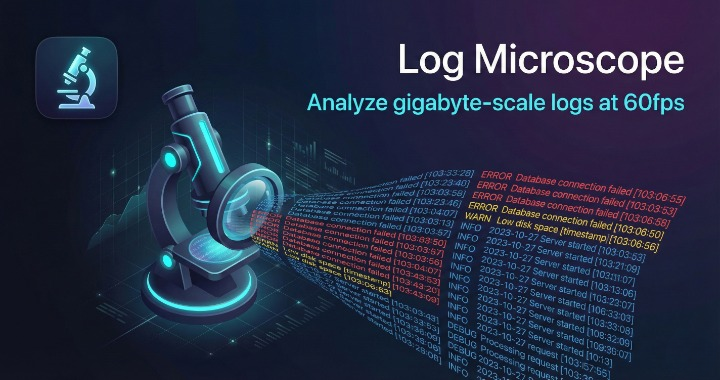

# Log Microscope

A high-performance desktop log viewer built for analyzing gigabyte-scale log files with ease. Built with Tauri, React, and Rust.



## Features

- **Memory-Mapped File Access** - Open multi-gigabyte log files instantly without loading them entirely into memory
- **Parallel Regex Search** - Blazing fast search powered by Rust's rayon and memchr with SIMD optimizations
- **SQL Query Support** - Query your logs using SQL syntax powered by Apache DataFusion
- **Virtualized Rendering** - Smooth 60 FPS scrolling through millions of lines
- **Recent Files** - Quick access to your last 7 opened files
- **Word Wrap Toggle** - Toggle word wrapping for long log lines
- **Dark Theme** - Easy on the eyes during long debugging sessions

## SQL Query Examples

Log Microscope includes a built-in SQL query engine. Some example queries:

```sql
-- Find all error lines
SELECT * FROM logs WHERE line LIKE '%ERROR%'

-- Count lines by log level
SELECT 
  CASE 
    WHEN line LIKE '%ERROR%' THEN 'ERROR'
    WHEN line LIKE '%WARN%' THEN 'WARN'
    WHEN line LIKE '%INFO%' THEN 'INFO'
    ELSE 'OTHER'
  END as level,
  COUNT(*) as count
FROM logs GROUP BY 1

-- Search with regex
SELECT * FROM logs WHERE regex_match(line, 'user_id=\d+')

-- Extract JSON fields
SELECT json_extract(line, '$.timestamp') as ts FROM logs
```

## Installation

### Pre-built Binaries

Download the latest release for your platform from the [Releases](https://github.com/Streamline1175/log-microscope/releases) page.

### Build from Source

Prerequisites:
- Node.js 18+
- Rust 1.70+
- Platform-specific dependencies for Tauri (see [Tauri Prerequisites](https://tauri.app/start/prerequisites/))

```bash
# Clone the repository
git clone https://github.com/Streamline1175/log-microscope.git
cd log-microscope

# Install dependencies
npm install

# Run in development mode
npm run tauri dev

# Build for production
npm run tauri build
```

## Tech Stack

### Frontend
- React 18 with TypeScript
- TanStack Virtual for virtualized list rendering
- Vite for fast development and building

### Backend (Rust)
- Tauri v2 for desktop application framework
- memmap2 for memory-mapped file access
- memchr for SIMD-accelerated byte searching
- rayon for parallel processing
- Apache DataFusion for SQL query engine
- Apache Arrow for columnar data format

## Usage

1. Launch Log Microscope
2. Click "Open Log File" or select from recent files
3. Use the search bar for regex pattern matching
4. Press F3 or Cmd/Ctrl+G to navigate between search results
5. Click "SQL" to open the query panel for advanced analysis
6. Click "Examples" to see SQL query examples

### Keyboard Shortcuts

| Shortcut | Action |
|----------|--------|
| Enter | Execute search |
| F3 | Next search result |
| Shift+F3 | Previous search result |
| Cmd/Ctrl+G | Next search result |
| Cmd/Ctrl+Shift+G | Previous search result |

## License

MIT License - see LICENSE file for details.

## Contributing

Contributions are welcome! Please feel free to submit a Pull Request.
